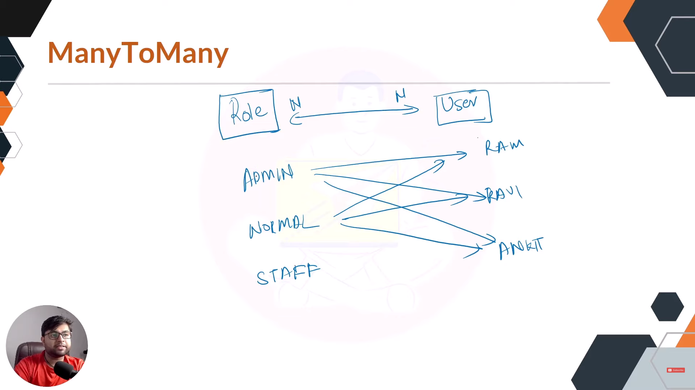

# Getting Started


## ONE TO ONE Mapping 

1.  Unidirectional Mapping 

```

@Entity
@Table(name = "jpa_Student")
public class Student {

	@Id
	@GeneratedValue(strategy = GenerationType.IDENTITY)
	private Long id;
	private String name;
	private String about;

	@OneToOne(cascade = CascadeType.ALL)
	private Laptop laptop;

	... getters and setters

}


@Entity
@Table(name = "jpa_Laptop")
public class Laptop {

	@Id
	@GeneratedValue(strategy = GenerationType.IDENTITY)
	private long id;
	private String brand;
	private String modelNumber;

	... getters and setters

}

Now when we run the code we can see the :

Table like 

```


1.  Bidirectional Mapping 

```

@Entity
@Table(name = "jpa_Student")
public class Student {

	@Id
	@GeneratedValue(strategy = GenerationType.IDENTITY)
	private Long id;
	private String name;
	private String about;

	@OneToOne(cascade = CascadeType.ALL)
	private Laptop laptop;

	... getters and setters

}


@Entity
@Table(name = "jpa_Laptop")
public class Laptop {

	@Id
	@GeneratedValue(strategy = GenerationType.IDENTITY)
	private long id;
	private String brand;
	private String modelNumber;
@OneToOne(cascade = CascadeType.ALL)
	private Student student;
 
	... getters and setters

}

Now when we run the code we can see the :

Table like 

```


### but this is not required to have to columns in both the tables Bidirectional can be manged by single column as well using mapped by

##  Understanding Mapped by 

- Ok what if we want the columns to be like 

```
Student :

| id |  name | about |


Laptop : 

| id |  name | brand | studentID |


so from we can get laptop details from by student id from the laptop tables it self


code : 


-------
@EqualsAndHashCode(of = { "id" }) //this is just mapping PK 

@AllArgsConstructor
@NoArgsConstructor
@Setter
@Getter
@Entity
@Table(name = "jpa_Laptop")
public class Laptop {

	@Id
	@GeneratedValue(strategy = GenerationType.IDENTITY)
	private long id;
	private String brand;
	private String modelNumber;

	@OneToOne
	private Student student;

}


@EqualsAndHashCode(of = { "id" }) //this is just mapping PK 
@AllArgsConstructor
@NoArgsConstructor
@Setter
@Getter
@Entity
@Table(name = "jpa_Student")
public class Student {

	@Id
	@GeneratedValue(strategy = GenerationType.IDENTITY)
	private Long id;
	private String name;
	private String about;

	@OneToOne(mappedBy = "student")
	private Laptop laptop;

}


-------


Note in this code if we 

	@OneToOne(mappedBy = "laptop")
	private Student student;


	in laptop class  we will get error : 
	Caused by: org.hibernate.AnnotationException: Association 'com.ashfaq.example.model.Laptop.student' is 'mappedBy' a property named 'laptop' which does not exist in the target entity type 'com.ashfaq.example.model.Student'
 
 so we have to do this any one side and not both 


```


- if we did other side removing in student and adding in laptop class 


### Renaming the column 

we have to do using JoinColumn(name)  in the student class

```
	@OneToOne
	@JoinColumn(name = "std_ID")
	private Student student;


```


Note : 
We should add cascade= ALL so when main object is saved with it,the child object will be automatically saved


## ONE TO MANY Mapping


1.  Unidirectional Mapping 
- from student to address 

```
@EqualsAndHashCode(of = { "id" })
@AllArgsConstructor
@NoArgsConstructor
@Setter
@Getter
@Entity
@Table(name = "jpa_Student")
public class Student {

	@Id
	@GeneratedValue(strategy = GenerationType.IDENTITY)
	private Long id;
	private String name;
	private String about;

	@OneToOne(mappedBy = "student")

	private Laptop laptop;

	// many address
	@OneToMany(cascade = CascadeType.ALL)
	List<Address> address;
}


@EqualsAndHashCode(of = { "id" })
@AllArgsConstructor
@NoArgsConstructor
@Setter
@Getter
@Entity
@Table(name = "jpa_Address")
public class Address {

	@Id
	@GeneratedValue(strategy = GenerationType.IDENTITY)
	private long id;
	private String street;
	private String city;

}


as we have one to many relation ship here we will have 3 tables 
 student table , address table and one for their relationship


```


2.  Bidirectional Mapping 

- from student to address and address to student 
now we can fetch student from address and adress from relationship table as both will have their PK ,but again we will have one more same table will be created for their relationship as earlier 

```

@EqualsAndHashCode(of = { "id" })
@AllArgsConstructor
@NoArgsConstructor
@Setter
@Getter
@Entity
@Table(name = "jpa_Student")
public class Student {

	@Id
	@GeneratedValue(strategy = GenerationType.IDENTITY)
	private Long id;
	private String name;
	private String about;

	@OneToOne(mappedBy = "student")

	private Laptop laptop;

	// many address
	@OneToMany(cascade = CascadeType.ALL)
	List<Address> address;
}

@EqualsAndHashCode(of = { "id" })
@AllArgsConstructor
@NoArgsConstructor
@Setter
@Getter
@Entity
@Table(name = "jpa_Address")
public class Address {

	@Id
	@GeneratedValue(strategy = GenerationType.IDENTITY)
	private long id;
	private String street;
	private String city;

	@ManyToOne(cascade = CascadeType.ALL)
	private Student student;

}

```


- here the  relation table is extra and now by using mapped by we can just put student id in address table without having the extra table


### Understanding Mapped by

```
@EqualsAndHashCode(of = { "id" })
@AllArgsConstructor
@NoArgsConstructor
@Setter
@Getter
@Entity
@Table(name = "jpa_Student")
public class Student {

	@Id
	@GeneratedValue(strategy = GenerationType.IDENTITY)
	private Long id;
	private String name;
	private String about;

	@OneToOne(mappedBy = "student")

	private Laptop laptop;

	// many address
	@OneToMany(cascade = CascadeType.ALL, mappedBy = "student")
	List<Address> address;
}


@EqualsAndHashCode(of = { "id" })
@AllArgsConstructor
@NoArgsConstructor
@Setter
@Getter
@Entity
@Table(name = "jpa_Address")
public class Address {

	@Id
	@GeneratedValue(strategy = GenerationType.IDENTITY)
	private long id;
	private String street;
	private String city;

	@ManyToOne(cascade = CascadeType.ALL)
	private Student student;

}


```
- as using mapped by the extra relationship table is removed


### Renaming the column 

we have to do using JoinColumn(name)  in the student class


```
	@ManyToOne(cascade = CascadeType.ALL)
	@JoinColumn(name = "std_ID")
	private Student student;


```


## MANY TO MANY Mapping





1.  Unidirectional Mapping 
from categories to products 

```
@EqualsAndHashCode(of = { "cId" })
@AllArgsConstructor
@NoArgsConstructor
@Setter
@Getter
@Entity
@Table(name = "jpa_Category")
public class Category {

	@Id
	@GeneratedValue(strategy = GenerationType.IDENTITY)
	private Long cId;
	private String title;

	@ManyToMany(cascade = CascadeType.ALL)
	List<Product> products;

}


@EqualsAndHashCode(of = { "pId" })
@AllArgsConstructor
@NoArgsConstructor
@Setter
@Getter
@Entity
@Table(name = "jpa_Product")
public class Product {
	
	@Id
	@GeneratedValue(strategy = GenerationType.IDENTITY)
	private Long pId;
	private String productName;
}


so we will have 3 tables , 1 category 2 product table and 3 their relation table

```


2.  Bidirectional Mapping 
```
@EqualsAndHashCode(of = { "cId" })
@AllArgsConstructor
@NoArgsConstructor
@Setter
@Getter
@Entity
@Table(name = "jpa_Category")
public class Category {

	@Id
	@GeneratedValue(strategy = GenerationType.IDENTITY)
	private Long cId;
	private String title;

	@ManyToMany(cascade = CascadeType.ALL)
	List<Product> products;

} 


@EqualsAndHashCode(of = { "pId" })
@AllArgsConstructor
@NoArgsConstructor
@Setter
@Getter
@Entity
@Table(name = "jpa_Product")
public class Product {
	
	@Id
	@GeneratedValue(strategy = GenerationType.IDENTITY)
	private Long pId;
	private String productName;
	
	
	@ManyToMany(cascade = CascadeType.ALL)
	List<Category> categorys;
}


```

- And once we do the bidirectional mapping we can see 4 tables i.e 


### Understanding Mapped by
- as we had 4 tables where 2 were just relationship tables as we can see above so we have to use mapped to maintain just one table using mapped by 
i.e 
```

@EqualsAndHashCode(of = { "cId" })
@AllArgsConstructor
@NoArgsConstructor
@Setter
@Getter
@Entity
@Table(name = "jpa_Category")
public class Category {

	@Id
	@GeneratedValue(strategy = GenerationType.IDENTITY)
	private Long cId;
	private String title;

	@ManyToMany(cascade = CascadeType.ALL,mappedBy = "categorys")
	List<Product> products;

} 


@EqualsAndHashCode(of = { "pId" })
@AllArgsConstructor
@NoArgsConstructor
@Setter
@Getter
@Entity
@Table(name = "jpa_Product")
public class Product {
	
	@Id
	@GeneratedValue(strategy = GenerationType.IDENTITY)
	private Long pId;
	private String productName;
	
	
	@ManyToMany(cascade = CascadeType.ALL)
	List<Category> categorys;
}

now we can see the new table below and we will have 3 tables 
```


-----------
