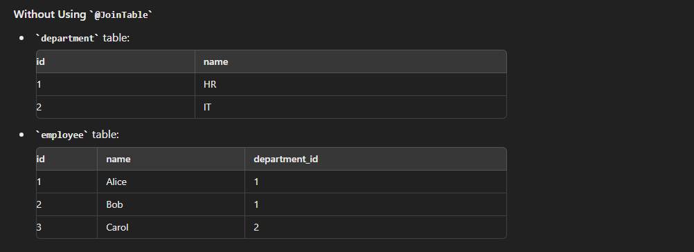
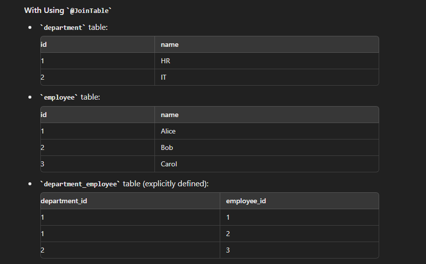

## Assuming the bidirectional mapping is done , (i,e this is only bidirectional mapping but with modification)
##  Let's consider a one-to-many relationship using the @JoinTable annotation in a different context. We'll use Department and Employee as our entities where one department can have many employees.
## Each department can have multiple employees, but each employee belongs to only one department.


## Without Using @JoinTable

```

import javax.persistence.*;
import java.util.Set;

@Entity
public class Department {
    @Id
    @GeneratedValue(strategy = GenerationType.IDENTITY)
    private Long id;
    private String name;

    @OneToMany(mappedBy = "department")
    private Set<Employee> employees;

    // getters and setters
}


import javax.persistence.*;

@Entity
public class Employee {
    @Id
    @GeneratedValue(strategy = GenerationType.IDENTITY)
    private Long id;
    private String name;

    @ManyToOne
    @JoinColumn(name = "department_id")
    private Department department;

    // getters and setters
}


```




## With Using @JoinTable

```
import java.util.Set;

@Entity
public class Department {
    @Id
    @GeneratedValue(strategy = GenerationType.IDENTITY)
    private Long id;
    private String name;

    @OneToMany
    @JoinTable(
        name = "department_employee",
        joinColumns = @JoinColumn(name = "department_id"),
        inverseJoinColumns = @JoinColumn(name = "employee_id")
    )
    private Set<Employee> employees;

    // getters and setters
}


@Entity
public class Employee {
    @Id
    @GeneratedValue(strategy = GenerationType.IDENTITY)
    private Long id;
    private String name;

    // getters and setters
}


```





### Explanation
- Without @JoinTable, JPA uses a foreign key in the employee table to establish the relationship with the department table.
- With @JoinTable, a separate join table department_employee is used to define the relationship, providing more flexibility in specifying the join columns and table properties.