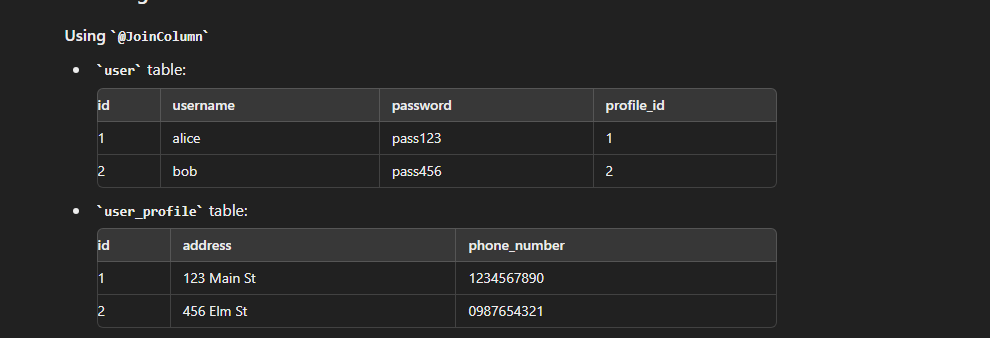

## The @JoinTable annotation is not typically used for one-to-one relationships. Instead, @JoinColumn is the more appropriate choice.

```

@Entity
public class User {
    @Id
    @GeneratedValue(strategy = GenerationType.IDENTITY)
    private Long id;
    private String username;
    private String password;

    @OneToOne
    @JoinColumn(name = "profile_id")
    private UserProfile profile;

    // getters and setters
}


@Entity
public class UserProfile {
    @Id
    @GeneratedValue(strategy = GenerationType.IDENTITY)
    private Long id;
    private String address;
    private String phoneNumber;

    @OneToOne(mappedBy = "profile")
    private User user;

    // getters and setters
}


```



