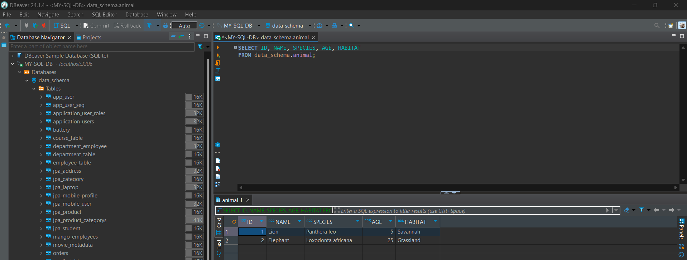

In Spring Boot, we can use various properties to control how SQL initialization scripts are executed at application startup.

1. spring.sql.init.mode

This property controls when the SQL initialization scripts (schema.sql and data.sql) are executed. It has several options:

- never: SQL scripts will not be executed.

- embedded: SQL scripts will only be executed if an embedded database is detected (e.g., H2, HSQLDB).

- always: SQL scripts will be executed regardless of the type of database (embedded or not).


```
spring.sql.init.mode=always

Setting this to always means that Spring Boot will run the SQL initialization scripts every time the application starts, regardless of whether the database is embedded or not.

```
2. spring.sql.init.schema-locations

This property specifies the location of the schema initialization script(s). This script is used to create or update the database schema.

- classpath:schema.sql: Refers to a file named schema.sql located in the src/main/resources directory or in the classpath of wer application.

```
spring.sql.init.schema-locations=classpath:schema.sql

This tells Spring Boot to look for a schema.sql file in the classpath and execute it during startup to set up the database schema.

```

3. spring.sql.init.data-locations

This property specifies the location of the data initialization script(s). This script is used to populate the database with initial data after the schema has been created.

- classpath:data.sql: Refers to a file named data.sql located in the src/main/resources directory or in the classpath of wer application.

```
spring.sql.init.data-locations=classpath:data.sql

This tells Spring Boot to look for a data.sql file in the classpath and execute it to insert initial data into the database.
```


```


Usage Example
If we want to use these properties to ensure that wer SQL scripts are always run on application startup, we would configure wer application.properties or application.yml file as follows:

application.properties Example:

spring.sql.init.mode=always
spring.sql.init.schema-locations=classpath:schema.sql
spring.sql.init.data-locations=classpath:data.sql


application.yml Example:

spring:
  sql:
    init:
      mode: always
      schema-locations: classpath:schema.sql
      data-locations: classpath:data.sql


````


###  Behavior Summary

- Initialization Mode:

With spring.sql.init.mode=always, both schema.sql and data.sql will be executed every time the application starts.

Schema Script:

schema.sql will be executed first to set up or update the database schema.
Data Script:

data.sql will be executed after schema.sql to populate the database with initial data.





The behavior of CREATE TABLE IF NOT EXISTS in schema.sql script and the way data.sql is processed will be as follows:

Creating the Table:

CREATE TABLE IF NOT EXISTS ANIMAL ...:

This command will create the ANIMAL table only if it doesn’t already exist. If the table is already present, this command will be ignored and no error will be raised.
Inserting Data:

INSERT INTO ANIMAL ...:

This command will attempt to insert the specified data into the ANIMAL table. If the table doesn’t exist, we will get an error. If the table exists, it will insert the data. However, if wer script or application logic needs to handle cases where some data might already be present, we might need additional logic to avoid duplicate entries.

Handling Existing Data

If we want to ensure that data is inserted only if it does not already exist (to avoid duplication), we might need to write more complex SQL scripts. For instance, we could use conditions to check for the existence of specific records before inserting them.

```


-- Creating the table if it does not exist
CREATE TABLE IF NOT EXISTS ANIMAL (
    ID BIGINT AUTO_INCREMENT PRIMARY KEY,
    NAME VARCHAR(255) NOT NULL,
    SPECIES VARCHAR(255) NOT NULL,
    AGE INT NOT NULL,
    HABITAT VARCHAR(255)
);

-- Inserting data if it doesn't already exist
INSERT INTO ANIMAL (NAME, SPECIES, AGE, HABITAT)
SELECT 'Lion', 'Panthera leo', 5, 'Savannah'
WHERE NOT EXISTS (
    SELECT 1 FROM ANIMAL WHERE NAME = 'Lion' AND SPECIES = 'Panthera leo'
);

INSERT INTO ANIMAL (NAME, SPECIES, AGE, HABITAT)
SELECT 'Elephant', 'Loxodonta africana', 25, 'Grassland'
WHERE NOT EXISTS (
    SELECT 1 FROM ANIMAL WHERE NAME = 'Elephant' AND SPECIES = 'Loxodonta africana'
);
-- Repeat for other records


```


## Error Scenarios

```
1 

While running the app , the table is created , but if stopped and ran again the error is seen as table is already created 

CREATE TABLE  your_table_name (
    id INT AUTO_INCREMENT PRIMARY KEY,
    name VARCHAR(255) NOT NULL
);


CREATE TABLE IF NOT EXISTS your_table_name (
    id INT AUTO_INCREMENT PRIMARY KEY,
    name VARCHAR(255) NOT NULL
);

2 
Avoiding the duplicate data 

every time the app is stopped and rerun  the same data might be added 


eg in data.sql : 


INSERT INTO ANIMAL (NAME, SPECIES, AGE, HABITAT) VALUES
('Lion', 'Panthera leo', 5, 'Savannah'),
('Elephant', 'Loxodonta africana', 25, 'Grassland'),
('Penguin', 'Aptenodytes forsteri', 10, 'Antarctica'),
('Giraffe', 'Giraffa camelopardalis', 12, 'Savannah'),
('Tiger', 'Panthera tigris', 8, 'Rainforest');


should be written as 


-- Inserting data if it doesn't already exist
INSERT INTO ANIMAL (NAME, SPECIES, AGE, HABITAT)
SELECT 'Lion', 'Panthera leo', 5, 'Savannah'
WHERE NOT EXISTS (
    SELECT 1 FROM ANIMAL WHERE NAME = 'Lion' AND SPECIES = 'Panthera leo'
);

INSERT INTO ANIMAL (NAME, SPECIES, AGE, HABITAT)
SELECT 'Elephant', 'Loxodonta africana', 25, 'Grassland'
WHERE NOT EXISTS (
    SELECT 1 FROM ANIMAL WHERE NAME = 'Elephant' AND SPECIES = 'Loxodonta africana'
);
-- Repeat for other records


```