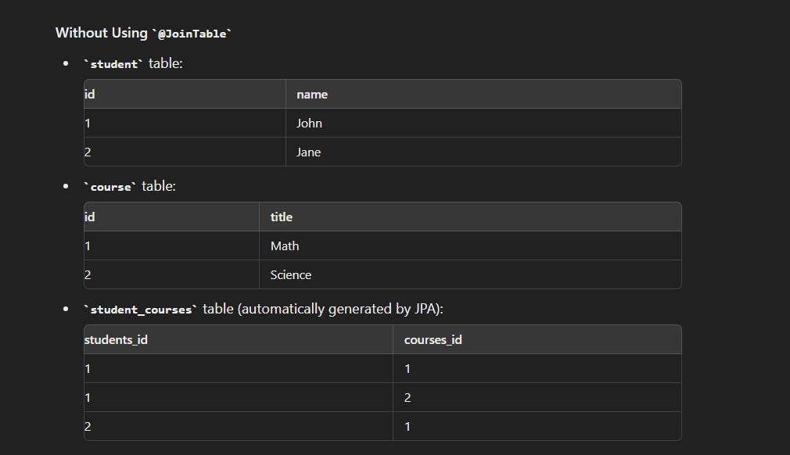
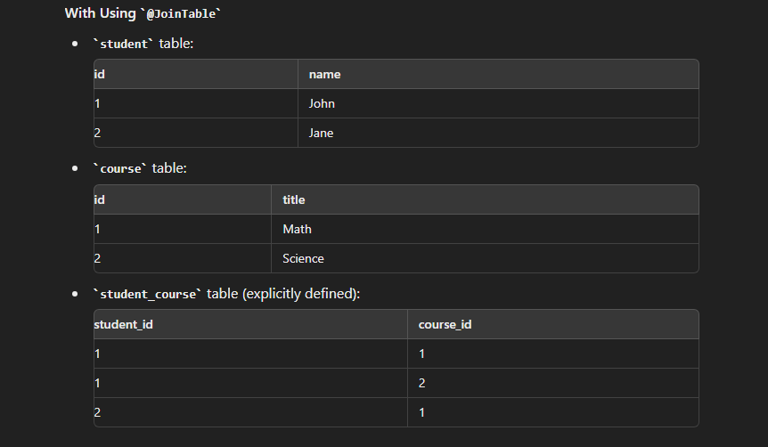
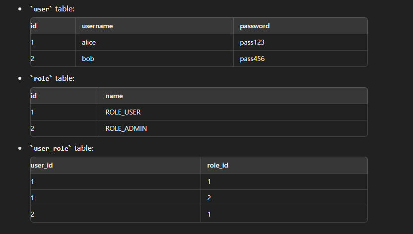

## Assuming Bidirectional mapping is already done 
## by default 3 tables will be created 

## Without Using @JoinTable

```

import java.util.Set;

@Entity
public class Student {
    @Id
    @GeneratedValue(strategy = GenerationType.IDENTITY)
    private Long id;
    private String name;

    @ManyToMany
    private Set<Course> courses;

    // getters and setters
}


import java.util.Set;

@Entity
public class Course {
    @Id
    @GeneratedValue(strategy = GenerationType.IDENTITY)
    private Long id;
    private String title;

    @ManyToMany(mappedBy = "courses")
    private Set<Student> students;

    // getters and setters
}


```




## With Using @JoinTable

```

import java.util.Set;

@Entity
public class Student {
    @Id
    @GeneratedValue(strategy = GenerationType.IDENTITY)
    private Long id;
    private String name;

    @ManyToMany
    @JoinTable(
        name = "student_course",
        joinColumns = @JoinColumn(name = "student_id"),
        inverseJoinColumns = @JoinColumn(name = "course_id")
    )
    private Set<Course> courses;

    // getters and setters
}


import java.util.Set;

@Entity
public class Course {
    @Id
    @GeneratedValue(strategy = GenerationType.IDENTITY)
    private Long id;
    private String title;

    @ManyToMany(mappedBy = "courses")
    private Set<Student> students;

    // getters and setters
}


```




### Explanation
- Without @JoinTable, JPA automatically generates a join table with default naming conventions and join column names.
- With @JoinTable, you have full control over the join table's name and the join columns, making the relationship definition clearer and more customizable.


### Eg : 

- In Spring Security, the relationship between users and roles (or authorities) is typically modeled as a many-to-many relationship. This is because:

- A user can have multiple roles.
- A role can be assigned to multiple users.

To illustrate this, let's create a simple example with User and Role entities.

```
import java.util.Set;

@Entity
public class User {
    @Id
    @GeneratedValue(strategy = GenerationType.IDENTITY)
    private Long id;
    private String username;
    private String password;

    @ManyToMany
    @JoinTable(
        name = "user_role",
        joinColumns = @JoinColumn(name = "user_id"),
        inverseJoinColumns = @JoinColumn(name = "role_id")
    )
    private Set<Role> roles;

    // getters and setters
}


import java.util.Set;

@Entity
public class Role {
    @Id
    @GeneratedValue(strategy = GenerationType.IDENTITY)
    private Long id;
    private String name;

    @ManyToMany(mappedBy = "roles")
    private Set<User> users;

    // getters and setters
}


```

