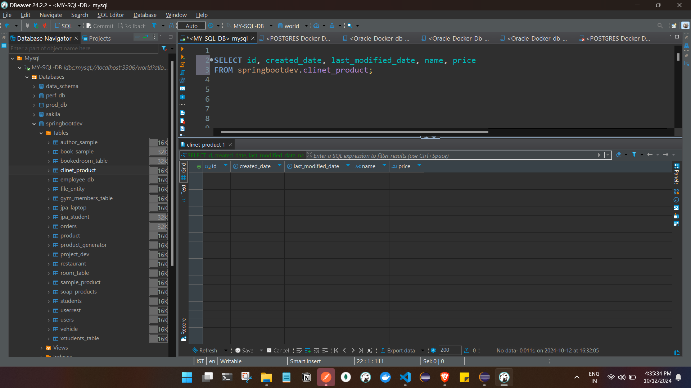
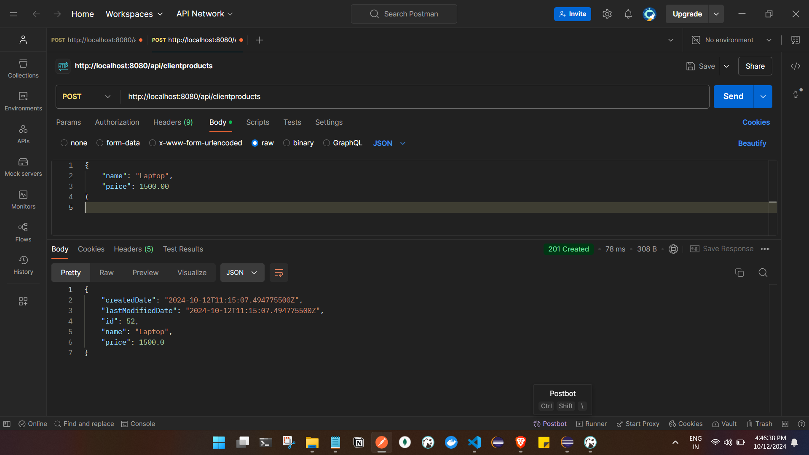
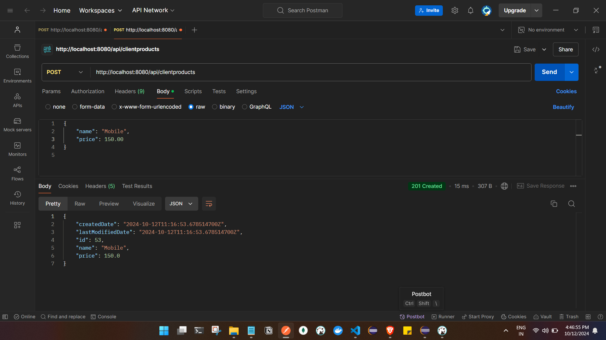
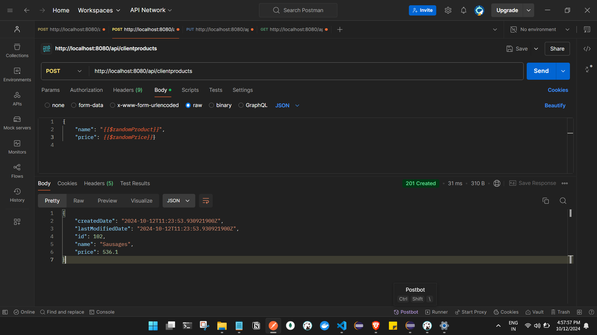
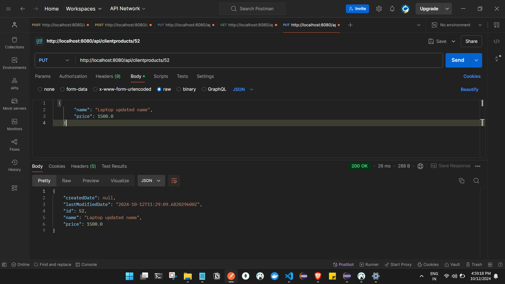
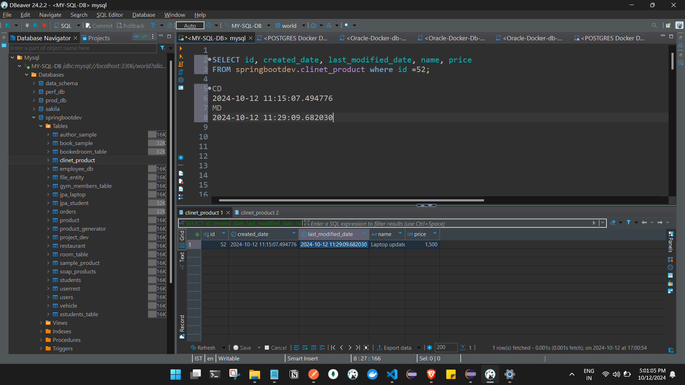
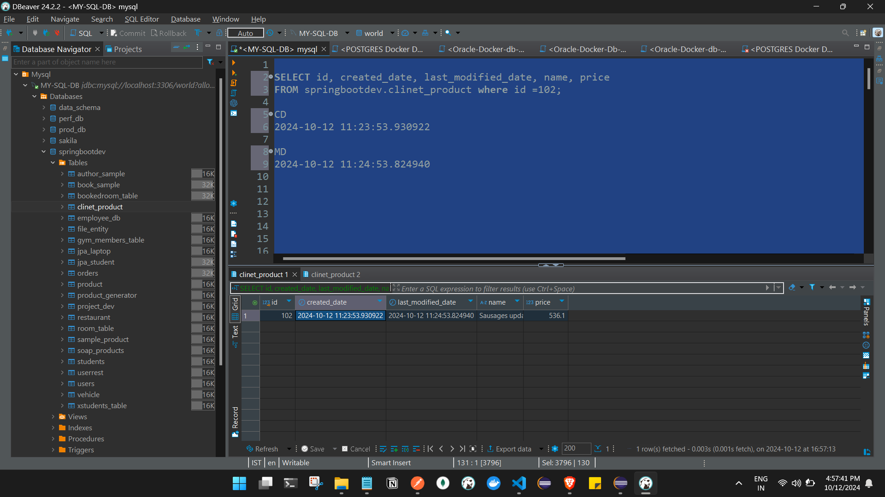

# Inheriting The columns and Auditing functinalities :

- Main Entity :

```
package com.ashfaq.example.auditing;

import jakarta.persistence.Column;
import jakarta.persistence.Entity;
import jakarta.persistence.GeneratedValue;
import jakarta.persistence.GenerationType;
import jakarta.persistence.Id;
import jakarta.persistence.SequenceGenerator;
import jakarta.persistence.Table;
import lombok.Data;

@Entity
@Table(name = "ClinetProduct")
@Data
public class ClinetProduct extends AbstractAuditingEntity<Long> {
    
    @Id
    @GeneratedValue(strategy = GenerationType.SEQUENCE, generator = "productSequenceGenerator")
    @SequenceGenerator(name = "productSequenceGenerator", sequenceName = "product_generator", allocationSize = 1)
    @Column(name = "id")
    private Long id;

    @Column(name = "name", nullable = false)
    private String name;

    @Column(name = "price", nullable = false)
    private Double price;


    @Override
    public Long getId() {
        return id;
    }

    
}

```

- 2 Auditing Functionalities  and Inheriting columns :

```
package com.ashfaq.example.auditing;

import java.io.Serializable;
import java.time.Instant;

import org.springframework.data.annotation.CreatedDate;
import org.springframework.data.annotation.LastModifiedDate;
import org.springframework.data.jpa.domain.support.AuditingEntityListener;

import jakarta.persistence.Column;
import jakarta.persistence.EntityListeners;
import jakarta.persistence.MappedSuperclass;
import lombok.Data;

@MappedSuperclass
@EntityListeners(AuditingEntityListener.class)
@Data
public abstract class AbstractAuditingEntity<T> implements Serializable {

	private static final long serialVersionUID = 1L;

	public abstract T getId();

	@CreatedDate
	@Column(updatable = false, name = "created_date")
	private Instant createdDate;

	@LastModifiedDate
	@Column(name = "last_modified_date")
	private Instant lastModifiedDate;

}

@CreatedDate and @LastModifiedDate:

These annotations tell Spring Data JPA that certain fields should be automatically populated with timestamps when an entity is persisted (created) or updated.
However, the annotations themselves don't know when to trigger the logic for populating these fields.

@EntityListeners(AuditingEntityListener.class):

The AuditingEntityListener is responsible for listening to entity lifecycle events (like when an entity is saved or updated) and then automatically setting the values of the fields annotated with @CreatedDate and @LastModifiedDate.
Without this listener, Spring Data JPA won’t know to automatically populate these fields when the entity is persisted or updated.

```

- To enable auditing functionality  add the annotation @EnableJpaAuditing in the main class : 

 - Table :
 


 - Note :
we do not need to set the createdDate and lastModifiedDate variables manually when saving or updating the entity.

Spring Data JPA will automatically manage these fields for you:

createdDate: Automatically set when the entity is persisted (i.e., first saved in the database).
lastModifiedDate: Automatically updated whenever the entity is modified and saved again.

Example Workflow:

New  Creation (Insert):
You don’t set the createdDate or lastModifiedDate.
Spring automatically sets the createdDate to the current timestamp when the entity is first saved.

 Update:
Spring updates the lastModifiedDate when you save an already-existing  entity. No need to set it manually.


Conclusion:
You do not manually pass the values for createdDate and lastModifiedDate. The whole point of using the @CreatedDate and @LastModifiedDate annotations is to let Spring manage these fields for you based on entity lifecycle events (create and update).


### Testing the functionality :

API POST : http://localhost:8080/api/clientproducts







Update API PUT :

 http://localhost:8080/api/clientproducts/

-  update api to udpate laptop name :
in response we are not seeing the createdDate data



- Verify in db :

- for laptop name :


- for sausage product :

 


 - Verifying in Get API :

 ```
 [
    {
        "createdDate": "2024-10-12T11:15:07.494776Z",
        "lastModifiedDate": "2024-10-12T11:29:09.682030Z",
        "id": 52,
        "name": "Laptop updated name",
        "price": 1500.0
    },
    {
        "createdDate": "2024-10-12T11:16:53.678515Z",
        "lastModifiedDate": "2024-10-12T11:23:01.291368Z",
        "id": 53,
        "name": "Mobile",
        "price": 180.0
    },
    {
        "createdDate": "2024-10-12T11:23:53.930922Z",
        "lastModifiedDate": "2024-10-12T11:24:53.824940Z",
        "id": 102,
        "name": "Sausages updated",
        "price": 536.1
    }
]
 ```