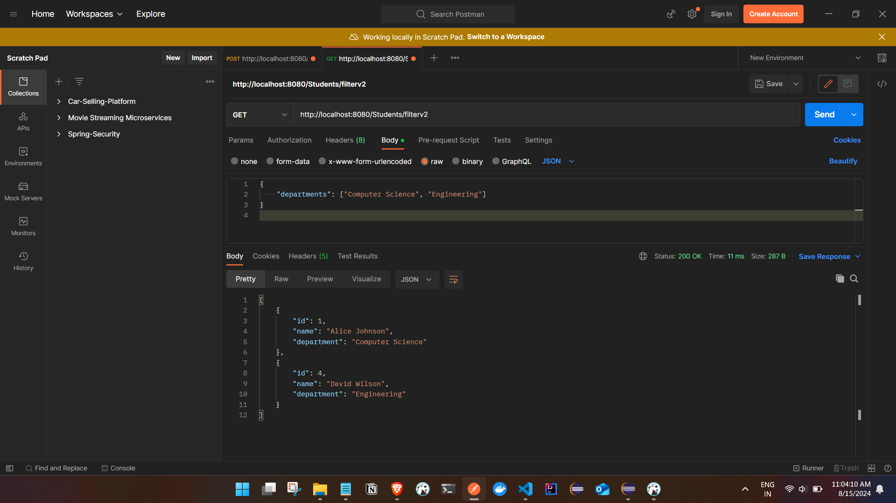

## Criteria API Explained

- Criteria queries in JPA (Java Persistence API) allow you to build dynamic and type-safe queries using the Java API. They are particularly useful when you need to create queries based on variable input, such as when filtering data dynamically.

### Key Components of Criteria Queries

- CriteriaBuilder: Used to construct criteria queries. It provides methods to create CriteriaQuery, Predicate, and other query components.

- CriteriaQuery: Represents the query you are building. You use it to specify the query's SELECT clause and other query components.

- Root: Represents the root entity in the query. It is the main entity that you are querying against.

- Predicate: Represents a condition in the query (e.g., WHERE clause). You use predicates to build the filtering logic of your query.

### CriteriaQuery API Methods

- CriteriaQuery.from(Root<?> root): Specifies the root entity for the query.
- CriteriaQuery.select(Selection<?>): Defines what to select in the query.
- CriteriaQuery.where(Predicate... restrictions): Adds conditions to the query.
- CriteriaQuery.orderBy(Order... orders): Specifies the ordering of the results.

- Dynamic Query Building: Use CriteriaBuilder to build queries dynamically based on provided filters.
- <http://localhost:8080/Students/filter>

## Hardcoded Mandatory Filters

```


{
    "ids": [1, 4],
    "names": ["Alice Johnson", "David Wilson"],
    "departments": [ "Engineering"]
}


```


- When  Single filter is provided

```
{
    "ids": [1, 4]
    

}

OR 

{
    "ids": [1, 4],
    "departments": ["Computer Science", "Engineering"]
}


```


## Dynamic Filters

-<http://localhost:8080/Students/filterv2>

```

{
    "ids": [1, 4],
    "names": ["Alice Johnson", "David Wilson"],
    "departments": ["Computer Science", "Engineering"]
}


```


- When  Single/Dynamic filter is provided

```
{
    "ids": [1, 4]
    

}
OR 
{
    "departments": ["Computer Science", "Engineering"]
}


OR 

{
    
    "departments": ["Computer Science", "Mathematics"]
}


```





```

@Service
public class StudentService {

 @Autowired
 private StudentRepository StudentRepository;
 @PersistenceContext
 private EntityManager entityManager;

 public List<Student> getStudentsByCriteria(List<Long> ids, List<String> names, List<String> departments) {
  return StudentRepository.findByIdsOrNamesOrDepartments(ids, names, departments);
 }

 public List<Student> getStudentsByCriteriav2(StudentFilterRequest filterRequest) {
  CriteriaBuilder cb = entityManager.getCriteriaBuilder();
  CriteriaQuery<Student> cq = cb.createQuery(Student.class);
  Root<Student> student = cq.from(Student.class);

  // List to hold predicates (conditions)
  List<Predicate> predicates = new ArrayList<>();

  // Add predicates based on the provided fields
  if (filterRequest.getIds() != null && !filterRequest.getIds().isEmpty()) {
   predicates.add(student.get("id").in(filterRequest.getIds()));
  }

  if (filterRequest.getNames() != null && !filterRequest.getNames().isEmpty()) {
   predicates.add(student.get("name").in(filterRequest.getNames()));
  }

  if (filterRequest.getDepartments() != null && !filterRequest.getDepartments().isEmpty()) {
   predicates.add(student.get("department").in(filterRequest.getDepartments()));
  }

  // Combine predicates using AND
  cq.where(cb.and(predicates.toArray(new Predicate[0])));

  // Execute query and return result
  return entityManager.createQuery(cq).getResultList();
 }
}

```

### Example Walkthrough

Here’s a breakdown of the example provided:

- Setting Up the CriteriaBuilder:


```
CriteriaBuilder cb = entityManager.getCriteriaBuilder();
CriteriaBuilder is used to construct the CriteriaQuery, predicates, and other query components.
```

- Creating a CriteriaQuery:

```
CriteriaQuery<Student> cq = cb.createQuery(Student.class);
CriteriaQuery represents the query you are building. You specify the entity type (Student in this case).
```

- Defining the Root:

```
Root<Student> student = cq.from(Student.class);
Root defines the main entity (root) of the query. It represents the Student entity in the query.
```


- Building Predicates:

```
List<Predicate> predicates = new ArrayList<>();
You create a list of Predicate objects, which represent the conditions of the query.
if (filterRequest.getIds() != null && !filterRequest.getIds().isEmpty()) {
    predicates.add(student.get("id").in(filterRequest.getIds()));
}
Here, you create a Predicate for filtering by IDs if IDs are provided in the request.

```


```
if (filterRequest.getNames() != null && !filterRequest.getNames().isEmpty()) {
    predicates.add(student.get("name").in(filterRequest.getNames()));
}
Similarly, create a Predicate for filtering by names.

```


```

if (filterRequest.getDepartments() != null && !filterRequest.getDepartments().isEmpty()) {
    predicates.add(student.get("department").in(filterRequest.getDepartments()));
}
Create a Predicate for filtering by departments.

```


- Combining Predicates:
```

cq.where(cb.and(predicates.toArray(new Predicate[0])));
Combine all the predicates using AND logic to form the complete query condition.

```

- Executing the Query:

```

return entityManager.createQuery(cq).getResultList();
```
Execute the query and return the results
