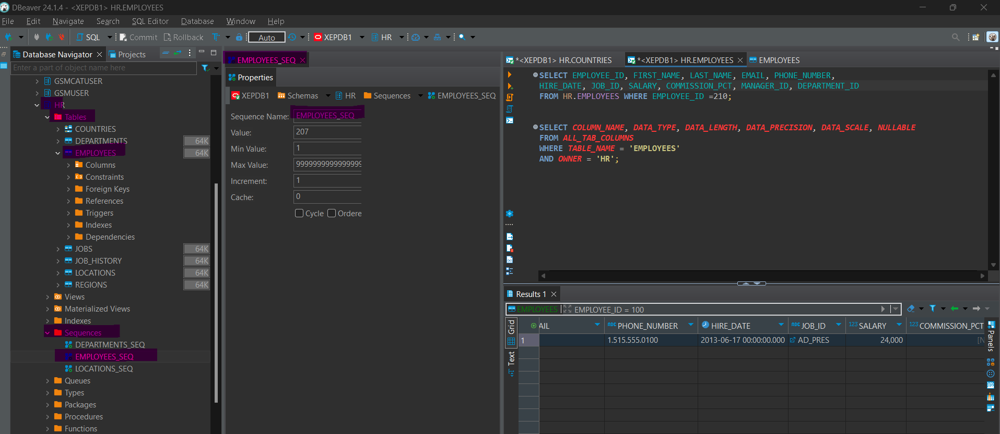
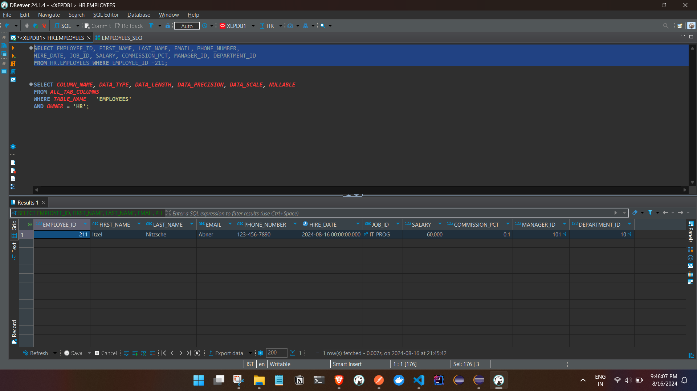
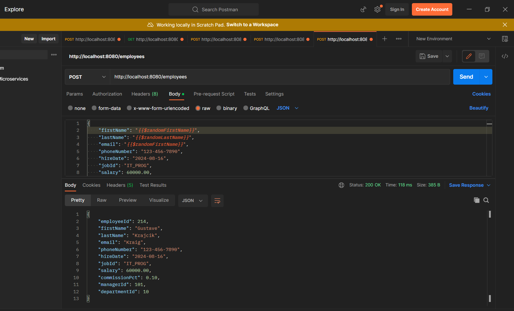

# The @GeneratedValue and @SequenceGenerator 
<h6>these annotations are used in JPA (Java Persistence API) to handle automatic generation of primary key values for an entity</h6>

### Eg :

- If we are inserting new data and have an existing sequence in the database (e.g., EMPLOYEES_SEQ), 





- we should configure our entity to use this sequence. 

- In that case, we can annotate the employeeId field with @GeneratedValue(strategy = GenerationType.SEQUENCE, generator = "employees_seq") and add a @SequenceGenerator annotation like this(we just need to know and provide the seq name):

```

@Id
@GeneratedValue(strategy = GenerationType.SEQUENCE, generator = "employees_seq")
@SequenceGenerator(name = "employees_seq", sequenceName = "EMPLOYEES_SEQ", allocationSize = 1)
@Column(name = "EMPLOYEE_ID", nullable = false)
private Long employeeId;


```

Code :

```

- App.props file

spring.datasource.url=jdbc:oracle:thin:@localhost:1521/XEPDB1
spring.datasource.username=hr
spring.datasource.password=admin
spring.datasource.driverClassName=oracle.jdbc.OracleDriver
spring.jpa.properties.hibernate.dialect=org.hibernate.dialect.OracleDialect

spring.jpa.show-sql=true
spring.jpa.hibernate.ddl-auto=update
#spring.jpa.database-platform=org.hibernate.dialect.OracleDialect
# Hibernate ddl auto (create, create-drop, validate, update)
#logging.level.org.hibernate=DEBUG


- Entity 

package com.ashfaq.example.model;

import java.math.BigDecimal;
import java.time.LocalDate;
import jakarta.persistence.*;
import jakarta.persistence.SequenceGenerator;
import lombok.*;


@Data
@AllArgsConstructor
@NoArgsConstructor
@Entity
@Table(name = "EMPLOYEES", schema = "HR")
public class Employee {


	 @Id - for PK 

	    @GeneratedValue(strategy = GenerationType.SEQUENCE, generator = "employees_seq")

        --defining the seq
        we are using GenerationType.SEQUENCE, which means the primary key values will be generated using a database sequence.

        generator: This specifies the name of the sequence generator that will be used for generating the primary key. The generator name should match the name defined in the @SequenceGenerator annotation.

	    @SequenceGenerator(name = "employees_seq", sequenceName = "EMPLOYEES_SEQ", allocationSize = 1)
        --The @SequenceGenerator annotation defines a sequence generator to be used by @GeneratedValue for generating unique primary key values.

1. name: The name of the sequence generator. This name is referenced by the generator attribute of @GeneratedValue. In your example, it is "employees_seq".

2. sequenceName: The name of the database sequence to be used for generating the primary key values. This should match the actual sequence name defined in your database. In your case, it is "EMPLOYEES_SEQ".

3. allocationSize: Specifies the increment size of the sequence. It defines how many values the sequence will preallocate and cache. For example, if allocationSize is set to 1, each primary key value is generated individually. A larger value means that the sequence generator will cache multiple values, which can improve performance but may lead to gaps in generated values if the application restarts.


	    @Column(name = "EMPLOYEE_ID", nullable = false)

    private Long employeeId;


    @Column(name = "FIRST_NAME", length = 20)
    private String firstName;

    @Column(name = "LAST_NAME", length = 25, nullable = false)
    private String lastName;

    @Column(name = "EMAIL", length = 25, nullable = false)
    private String email;

    @Column(name = "PHONE_NUMBER", length = 20)
    private String phoneNumber;

    @Column(name = "HIRE_DATE", nullable = false)
    private LocalDate hireDate;

    @Column(name = "JOB_ID", length = 10, nullable = false)
    private String jobId;

    @Column(name = "SALARY", precision = 8, scale = 2)
    private BigDecimal salary;

    @Column(name = "COMMISSION_PCT", precision = 2, scale = 2)
    private BigDecimal commissionPct;

    @Column(name = "MANAGER_ID")
    private Long managerId;

    @Column(name = "DEPARTMENT_ID")
    private Integer departmentId;
}


```


### Testing 


POST API - http://localhost:8080/employees sending employees object


```

Req Body 


{
    "firstName": "{{$randomFirstName}}",
    "lastName": "{{$randomLastName}}",
    "email": "{{$randomFirstName}}",
    "phoneNumber": "123-456-7890",
    "hireDate": "2024-08-16",
    "jobId": "IT_PROG",
    "salary": 60000.00,
    "commissionPct": 0.10,
    "managerId": 101,
    "departmentId": 10
}


Response body 

{
    "employeeId": 211,
    "firstName": "Itzel",
    "lastName": "Nitzsche",
    "email": "Abner",
    "phoneNumber": "123-456-7890",
    "hireDate": "2024-08-16",
    "jobId": "IT_PROG",
    "salary": 60000.00,
    "commissionPct": 0.10,
    "managerId": 101,
    "departmentId": 10
}

```
DB :




-- Other post call

